# ADA - Algorithm Design and Analysis

This repository contains implementations of various fundamental algorithms, categorized into **sorting**, **searching**, **similarity measures**, **matrix operations**, **optimization problems**, and **graph algorithms**.  
Each algorithm is implemented in **C++** (some in **Python**) and analyzed for **time complexity**, **space complexity**, and **performance**.  
Visual plots (`.png` images) have also been included for better analysis wherever applicable.

---

## 1. Sorting Algorithms
Sorting algorithms arrange data in a specific order. Efficiency of sorting is crucial in data structures, databases, and many real-world applications.

- **Selection Sort**
  - Iteratively selects the minimum element and places it in the correct position.
  - Time Complexity: O(n²).
  - 

- **Merge Sort**
  - A divide-and-conquer algorithm that recursively splits arrays and merges them efficiently.
  - Time Complexity: O(n log n).

- **Quick Sort**
  - Uses partitioning to sort elements recursively.
  - Best/Average Time Complexity: O(n log n), Worst: O(n²).
  - 
  - 

- **Bubble Sort**
  - Repeatedly swaps adjacent elements if they are in the wrong order.
  - Best Case: O(n), Worst/Average Case: O(n²).
  - 
  - 

- **Quick Sort Iterative**
  - Implements Quick Sort using an iterative approach to avoid stack overflows.
  - 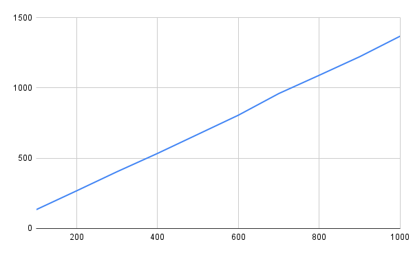

- **Quick Sort Stack Calls**
  - Analyzes the number of recursive stack calls in Quick Sort.

---

## 2. Searching Algorithms
Searching algorithms efficiently retrieve elements from datasets.

- **Linear Search**
  - Scans each element sequentially.
  - Best Case: O(1), Worst Case: O(n).
  - 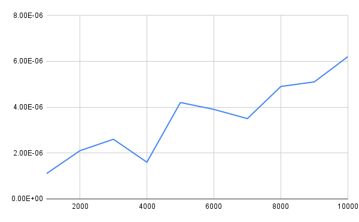

- **Binary Search**
  - Recursively divides the array to locate the target element.
  - Time Complexity: O(log n).
  - 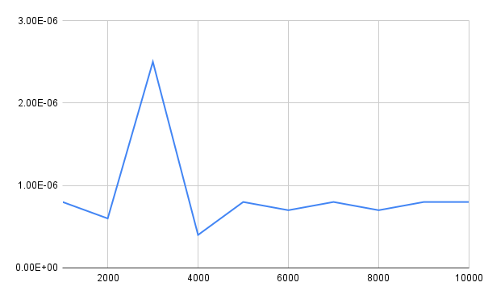

- **1D Peak Finding**
  - Finds a peak in a 1D array where an element is greater than its neighbors.
  - Time Complexity: O(log n).
  - 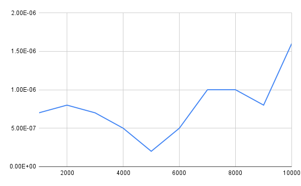

- **2D Peak Finding**
  - Finds a peak element in a 2D matrix using column-wise searching.
  - Time Complexity: O(n log m).
  - 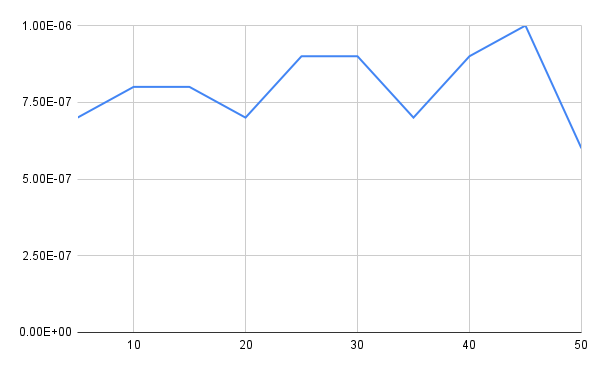

---

## 3. Similarity Measures
Similarity measures are used in data analysis, clustering, and recommendation systems.

- **Cosine Similarity**
  - Measures the cosine of the angle between two non-zero vectors.
  - Used in NLP and text similarity.
  
- **Jaccard Similarity**
  - Measures similarity between two sets as the intersection over union.
  - Used in text classification.

---

## 4. Matrix Operations
Matrix operations are critical in linear algebra, graphics, AI, and scientific computing.

- **Magic Square**
  - Generates a square matrix where the sum of each row, column, and diagonal is the same.
  - 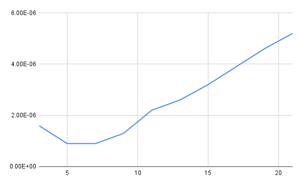

- **Matrix Multiplication - Brute Force**
  - Standard matrix multiplication using three nested loops. Time Complexity: O(n³).
  - 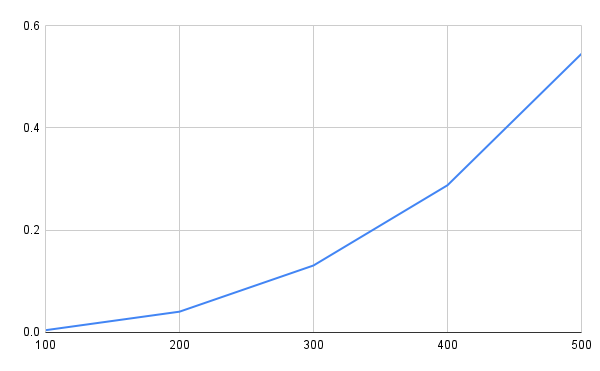

- **Matrix Multiplication - Divide and Conquer**
  - Recursively divides matrices and combines the results for multiplication.
  - Time Complexity: O(n³).
  - 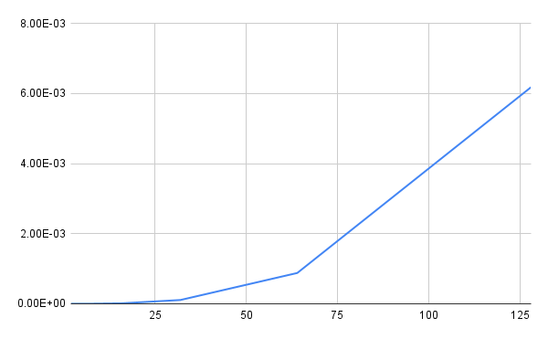

- **Matrix Multiplication - Strassen Algorithm**
  - Optimized approach that reduces multiplication operations.
  - Time Complexity: O(n².81).
  - 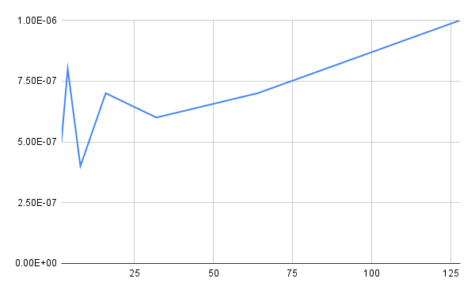

- **Determinant and Side Checking**
  - Calculates the determinant of a matrix and determines the relative position of points.
  - 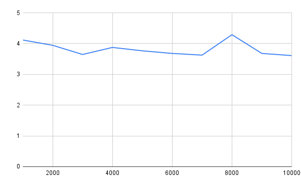

---

## 5. Optimization Problems
Optimization problems find the best solution among feasible alternatives.

- **Max-Min Problem**
  - Uses divide and conquer to find the maximum and minimum elements in an array.
  - 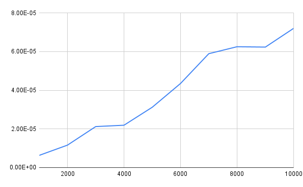

- **Knapsack Problem**
  - Solves the fractional knapsack problem using a greedy algorithm to maximize profit.
  - 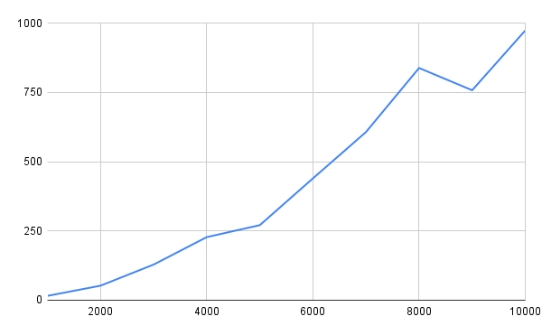

- **0-1 Knapsack Problem**
  - Solves the 0-1 variant of knapsack where items can't be broken.

- **Activity Selection**
  - Selects the maximum number of non-overlapping activities using a greedy approach.
  - 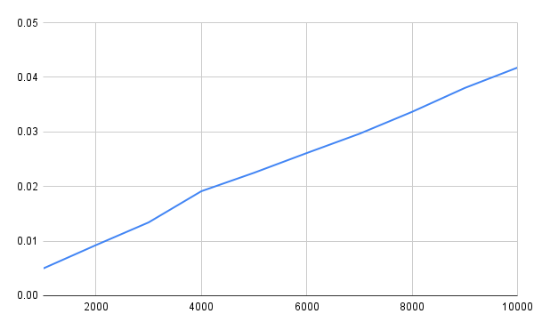

---

## 6. Graph Algorithms
Graph algorithms are fundamental in networking, AI, and operations research.

- **Dijkstra’s Algorithm**
  - Finds the shortest path from a single source vertex to all other vertices.
  - 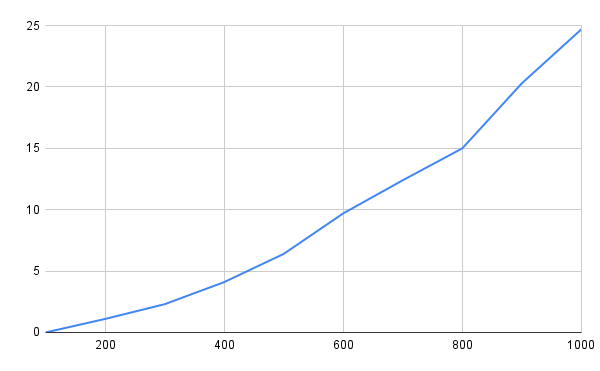

- **Prim’s Algorithm**
  - Constructs the Minimum Spanning Tree (MST) by adding the smallest edge at each step.
  - 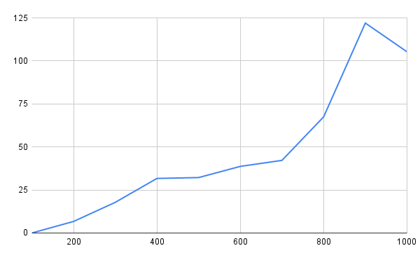

- **Kruskal’s Algorithm**
  - Constructs the MST by selecting the smallest edges while avoiding cycles.
  - 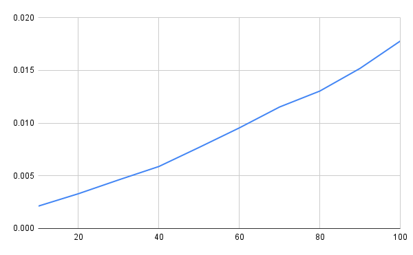

- **Multi-Stage Graphs**
  - Finds the shortest path in a multi-stage weighted graph.

- **All Pairs Shortest Paths (APSP)**
  - Computes shortest paths between all pairs of vertices in a weighted graph.

- **Graph Coloring**
  - Assigns colors to vertices of a graph such that no two adjacent vertices share the same color.

